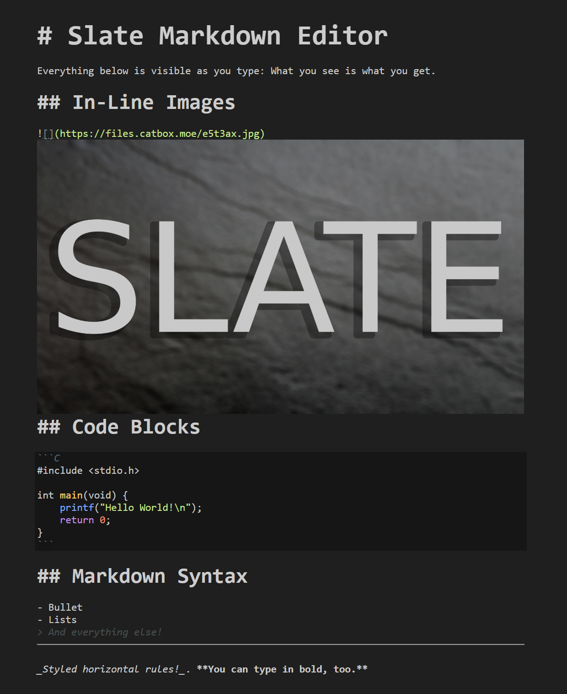

# Slate Markdown Editor

## Project Overview

This is a highly customized, lightweight Markdown editor built on CodeMirror 6.

The core philosophy of this project is to achieve a seamless markdown editing experience close to WYSIWYG in VSCode, without the clunkiness of many full-fledged editors. The project is heavily inspired by the likes of Typora and Obsidian.md. In an effort to make markdown editing seamless, the end result is something resembling a mix between EasyMDE and Obsidian.md's live preview mode. 

## Showcase

*Note: some elements look slightly different with the major update to CodeMirror 6. A new image is on its way.*

## For Developers

1. `git clone https://github.com/archiebhl/slate-markdown.git`
2. `cd slate-markdown`
3. `pnpm install`
4. `pnpm run compile`
5. Run with your method of choice. On VSCode, Press `F5` and run the extension for testing. 